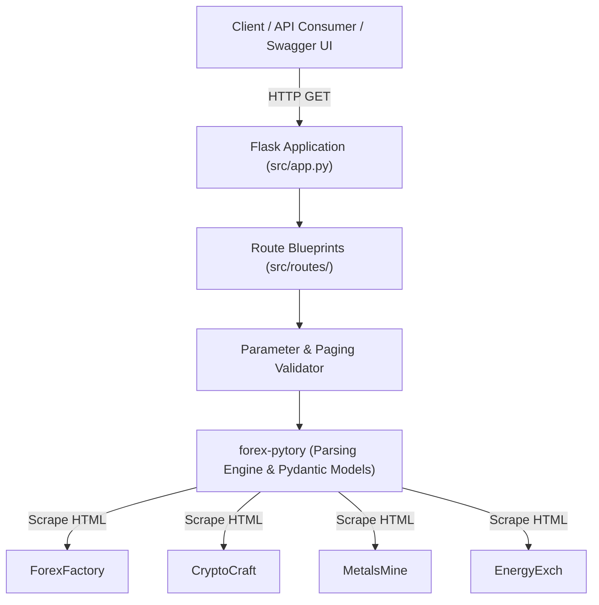

# ForexFactoryScrapper

[](https://github.com/AtaCanYmc/ForexFactoryScrapper/actions)
[](https://atacanymc.github.io/ForexFactoryScrapper/)
[](https://www.python.org/)
[](LICENSE)

ForexFactoryScrapper is a Flask REST API service that aggregates and serves economic calendar events from financial portals including ForexFactory, CryptoCraft, EnergyExch, and MetalsMine.

## Table of Contents

- [Architecture](#architecture)
- [Quick Start](#quick-start)
  - [Docker](#docker)
  - [Local Environment](#local-environment)
- [API Reference](#api-reference)
  - [Endpoint Overview](#endpoint-overview)
  - [Daily Events Endpoints](#daily-events-endpoints)
  - [Multi-Source Bundle Endpoint](#multi-source-bundle-endpoint)
  - [Sitemap Endpoint](#sitemap-endpoint)
  - [OpenAPI and Swagger UI](#openapi-and-swagger-ui)
- [Configuration](#configuration)
- [Testing and Verification](#testing-and-verification)
- [Documentation and Developer Commands](#documentation-and-developer-commands)
- [Frequently Asked Questions](#frequently-asked-questions)
- [Contributing](#contributing)
- [Security](#security)
- [License](#license)

## Architecture

All HTML extraction and DOM parsing logic is isolated within the upstream [`forex-pytory`](https://github.com/AtaCanYmc/forex-pytory) package. ForexFactoryScrapper acts exclusively as an HTTP API layer responsible for request validation, pagination, CORS handling, and OpenAPI schema generation.



## Quick Start

### Docker

Build and run the containerized service:

```bash
# 1. Build the Docker image
docker build -t forexfactory-scrapper .

# 2. Run container in background
docker run -d -p 5000:5000 --name forexfactory-scrapper forexfactory-scrapper

# 3. Verify health status
curl -f http://localhost:5000/api/health
```

### Local Environment

Prerequisites: Python 3.10, 3.11, or 3.12.

```bash
# 1. Create and activate virtual environment
python -m venv .venv
source .venv/bin/activate

# 2. Install dependencies
pip install -r requirements.txt

# 3. Start API server
python main.py
```

The application listens on `http://0.0.0.0:5000` by default.

Interactive documentation interfaces:
- Web Welcome Page: `http://localhost:5000/`
- Swagger UI: `http://localhost:5000/swagger`
- OpenAPI Specification: `http://localhost:5000/openapi.json`

## API Reference

### Endpoint Overview

| Method | Path | Required Parameters | Optional Parameters | Description |
| :--- | :--- | :--- | :--- | :--- |
| `GET` | `/` | None | None | HTML landing page with quick navigation links. |
| `GET` | `/api/hello` | None | None | Basic sanity check endpoint. |
| `GET` | `/api/health` | None | None | Service health check returning operational status. |
| `GET` | `/api/forex/daily` | `day`, `month`, `year` | `limit`, `offset` | ForexFactory economic calendar events for a specific day. |
| `GET` | `/api/cryptocraft/daily` | `day`, `month`, `year` | `limit`, `offset` | CryptoCraft calendar events for a specific day. |
| `GET` | `/api/energyexch/daily` | `day`, `month`, `year` | `limit`, `offset` | EnergyExch calendar events for a specific day. |
| `GET` | `/api/metalsmine/daily` | `day`, `month`, `year` | `limit`, `offset` | MetalsMine calendar events for a specific day. |
| `GET` | `/api/bundle` | `start_date`, `end_date` | `sources`, `limit`, `offset` | Aggregated economic events across selected platforms for a date range. |
| `GET` | `/api/forex/sitemaps` | None | `start_date`, `end_date`, `max_pages`, `limit`, `offset` | Paginated sitemap URLs retrieved from ForexFactory. |
| `GET` | `/swagger` | None | None | Swagger UI documentation console. |
| `GET` | `/openapi.json` | None | None | Raw OpenAPI 3.0 schema definition. |

### Daily Events Endpoints

Available routes:
- `/api/forex/daily`
- `/api/cryptocraft/daily`
- `/api/energyexch/daily`
- `/api/metalsmine/daily`

#### Query Parameters

| Parameter | Type | Required | Description |
| :--- | :--- | :---: | :--- |
| `day` | Integer | Yes | Calendar day of month (1-31). |
| `month` | Integer | Yes | Calendar month (1-12). |
| `year` | Integer | Yes | Four-digit calendar year. |
| `limit` | Integer | No | Maximum number of records to return. Must be non-negative. |
| `offset` | Integer | No | Number of records to skip for pagination. Must be non-negative. |

#### Response Schema

```json
{
  "total": 14,
  "offset": 0,
  "limit": 10,
  "results": [
    {
      "id": "138542",
      "date": "2026-05-20",
      "time": "8:30am",
      "currency": "USD",
      "impact": "High",
      "event": "CPI m/m",
      "actual": "0.3%",
      "forecast": "0.2%",
      "previous": "0.4%"
    }
  ]
}
```

### Multi-Source Bundle Endpoint

Path: `GET /api/bundle`

Retrieves events from multiple calendar providers over a continuous date range.

#### Query Parameters

| Parameter | Type | Default | Description |
| :--- | :--- | :--- | :--- |
| `start_date` | String (`YYYY-MM-DD`) | Required | Start date of query range (inclusive). |
| `end_date` | String (`YYYY-MM-DD`) | Required | End date of query range (inclusive). |
| `sources` | Comma-separated string | `forex` | Target sources to scrape: `forex`, `crypto`, `metal`, `energy`. |
| `limit` | Integer | None | Maximum total records to return. |
| `offset` | Integer | `0` | Number of records to skip across aggregated results. |

#### Example Request

```bash
curl "http://localhost:5000/api/bundle?sources=forex,crypto&start_date=2026-05-20&end_date=2026-05-21&limit=25"
```

#### Response Structure

```json
{
  "total": 28,
  "offset": 0,
  "limit": 25,
  "start_date": "2026-05-20",
  "end_date": "2026-05-21",
  "sources": ["forex", "crypto"],
  "source_breakdown": {
    "forex": 18,
    "crypto": 10
  },
  "results": [
    {
      "_source": "forex",
      "_date": "2026-05-20",
      "id": "138542",
      "currency": "USD",
      "event": "CPI m/m"
    }
  ]
}
```

### Sitemap Endpoint

Path: `GET /api/forex/sitemaps`

Traverses the ForexFactory sitemap index and child sitemaps to locate indexed historical URLs.

#### Query Parameters

| Parameter | Type | Default | Description |
| :--- | :--- | :--- | :--- |
| `start_date` | String (`YYYY-MM-DD`) | None | Filter sitemaps with `lastmod` on or after this date. |
| `end_date` | String (`YYYY-MM-DD`) | None | Filter sitemaps with `lastmod` on or before this date. |
| `max_pages` | Integer | `10` | Maximum child sitemaps to parse. Must be positive integer. |
| `limit` | Integer | None | Pagination size for URL list. |
| `offset` | Integer | `0` | Pagination offset. |

### OpenAPI and Swagger UI

The API specification is defined in `src/openapi_spec.py`.
- Swagger UI is accessible at `/swagger`.
- Machine-readable schema is served at `/openapi.json`.

When modifying endpoints, keep `src/openapi_spec.py` synchronized with route implementations.

## Configuration

The service reads configuration from environment variables or a local `.env` file via `python-dotenv`.

| Variable | Type | Default | Required | Description |
| :--- | :--- | :--- | :---: | :--- |
| `HOST` | String | `0.0.0.0` | No | Network interface to bind the Flask server. |
| `PORT` | Integer | `5000` | No | Port number to accept incoming connections. |
| `DEBUG` | Boolean | `True` | No | Enable Flask debug reloader and error tracebacks. |
| `DOTENV_PATH` | String (Path) | None | No | Explicit file path to load environment variables from. |

## Testing and Verification

Execute unit and integration tests using pytest:

```bash
python -m pytest -q
```

Test files are located under `tests/`. External network requests are monkeypatched in test suites to ensure fast and deterministic execution.

## Documentation and Developer Commands

A `Makefile` is provided to streamline local development, testing, and documentation generation:

| Command | Description |
| :--- | :--- |
| `make install` | Install project runtime and testing dependencies. |
| `make run` | Start the Flask development server on `0.0.0.0:5000`. |
| `make test` | Execute test suite via pytest. |
| `make lint` | Run flake8 and black formatting checks. |
| `make format` | Auto-format Python files with black. |
| `make docker-build` | Build the container image. |
| `make docker-run` | Run the containerized service. |
| `make docs-install` | Install MkDocs Material toolchain. |
| `make docs-serve` | Start MkDocs local preview server on `127.0.0.1:8000`. |
| `make docs-build` | Compile static documentation site to `site/`. |
| `make clean` | Clean pycache and temporary build artifacts. |

## Frequently Asked Questions

#### Why is the scraping engine separated into forex-pytory?
Separating the scraper into `forex-pytory` establishes distinct boundaries between HTTP presentation and HTML parsing. If target sites modify their HTML DOM, parser updates occur exclusively in `forex-pytory` without requiring redeployment or changes to the API routing layer.

#### Does this service cache calendar responses?
The API does not maintain an internal database or caching layer. Requests trigger live upstream fetches through `forex-pytory`. Upstream rate limits apply based on calling IP frequency.

#### How are invalid dates or parameters handled?
Parameters are validated before invoking upstream scrapers. Malformed dates, non-integer date components, or negative pagination limits immediately return HTTP 400 with a structured JSON error body: `{"error": "..."}`.

## Contributing

Review development practices, branch naming conventions, and pull request requirements in [CONTRIBUTING.md](CONTRIBUTING.md).

## Security

To report security vulnerabilities privately, follow the instructions in [SECURITY.md](SECURITY.md).

## License

This project is licensed under the terms of the [MIT License](LICENSE).
Copyright (c) 2026 Ata Can Yaymacı.
