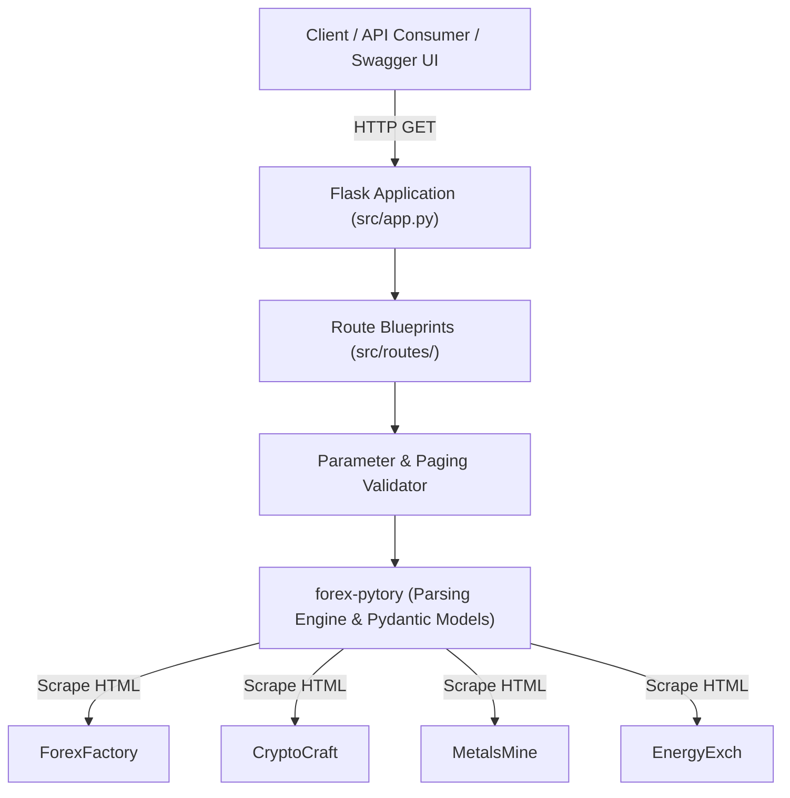

# System Architecture

ForexFactoryScrapper decouples HTTP API routing and presentation from web scraping logic.

## Decoupled Architecture

All HTML extraction and DOM parsing is managed upstream by the [`forex-pytory`](https://github.com/AtaCanYmc/forex-pytory) package. ForexFactoryScrapper delegates data fetching entirely to that library and focuses solely on providing an HTTP REST API interface.

### Architectural Rationale

- **Modularity**: The scraping engine and the web server operate as independent modules.
- **Maintainability**: Markup alterations on target financial calendars only necessitate updates in `forex-pytory`, leaving API routes untouched.
- **Type Safety**: Validation and schema serialization are managed strictly with Pydantic models at the library layer.

## Component Flow

